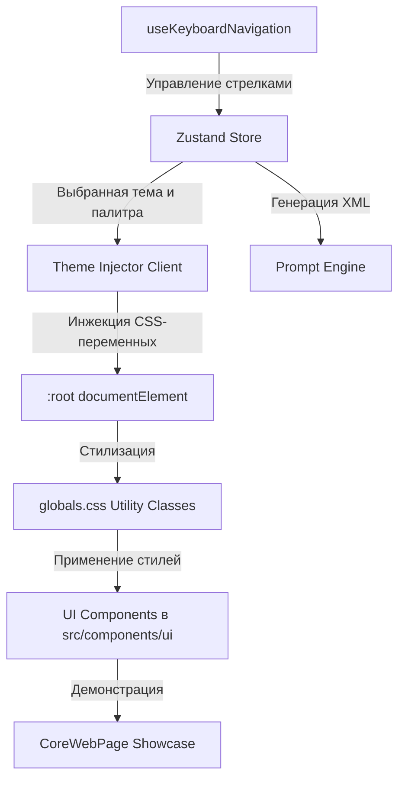

# Архитектура проекта Core-web

Core-web — это интерактивная платформа для генерации, визуализации и экспорта высокоплотных дизайн-токенов и UI-шаблонов. Проект построен на базе **Next.js 16 (App Router)**, **React 19**, **Tailwind CSS v4** и **Zustand**.

Данный документ описывает внутреннюю архитектуру системы стилей, механизм динамического инжектирования переменных, структуру хранилища и правила расширения библиотеки компонентов.

---

## 🏗️ Общая схема взаимодействия



---

## 🎨 Параметрическая дизайн-система

Визуальный язык Core-web спроектирован как **цвет-агностическая система** (color-agnostic system). Это означает, что геометрия, тени, оптические эффекты и анимация отделены от хроматической (цветовой) составляющей. 

Контрасты и состояния взаимодействия формируются динамически с помощью наложения нейтральных альфа-композитов и функций смешивания цветов OKLCH.

### 1. Объявление токенов и тем
Все настройки тем описаны в [themes.ts](../src/config/themes.ts). Каждая тема включает:
*   `tokens.geometry`: радиусы скруглений, толщина рамок, тени.
*   `tokens.effects`: сложные фильтры (например, Backdrop Blur).
*   `tokens.animation`: длительность переходов, функции плавности (кривые Безье), ховер/актив трансформации.
*   `componentRules`: специфические правила в текстовом виде для AI-ассистентов.

### 2. Динамические цветовые палитры
Темы содержат как общие палитры (`sharedPalettes`), так и индивидуальные наборы палитр:
*   *Необрутализм*: Яркие, контрастные цвета (*Yellow Pop Art*, *Cyber Pink*).
*   *Глассморфизм*: Полупрозрачные градиентные фоны (*Aurora Blue*, *Rose Quartz*).
*   *Моноширинный терминал*: Зеленое и янтарное фосфорное свечение (*Phosphor Green*, *Phosphor Amber*).
*   *Диффузное свечение*: Неоновые цвета с сильным свечением (*Neon Cyberpunk*, *Retrowave Sunset*).

---

## 🔌 Механизм инжектирования стилей

Инжектор стилей [ThemeInjector.tsx](../src/components/ThemeInjector.tsx) слушает изменения активной темы и палитры в Zustand-сторе и обновляет корневой элемент страницы:

1.  **Конвертация цветов в HSL**: Вспомогательная функция `hexToHsl` преобразует HEX-цвета палитры в HSL-компоненты. Это необходимо для совместимости с дизайн-системой Shadcn UI и нативной работы прозрачности в Tailwind.
2.  **Запись в `:root`**: Записывает значения цветов во встроенные переменные (`--background`, `--foreground`, `--primary`, `--border`, `--ring` и т.д.).
3.  **Инжекция физических свойств**: Устанавливает значения кастомных переменных:
    *   `--theme-border-radius`
    *   `--theme-border-width`
    *   `--theme-box-shadow`
    *   `--theme-backdrop-filter`
    *   `--theme-transition-duration`
    *   `--theme-transition-timing-function`
4.  **Специфические переопределения (Хаки тем)**:
    *   *Glassmorphism*: Переопределяет поверхность и границы на полупрозрачные альфа-цвета.
    *   *Tactile Emboss (Неоморфизм)*: Вычисляет светлые и темные фаски теней относительно активного фона и режима темы (светлая/темная).
    *   *Monospaced Terminal*: Подключает моноширинные шрифты, активирует CRT-сетку и свечение текста.
    *   *Haptic Sharp*: Генерирует 45-градусные скосы углов с помощью CSS `clip-path`.

---

## 💾 Управление состоянием и навигация

### Состояние (Zustand Store)
Хранилище [useThemeStore.ts](../src/store/useThemeStore.ts) управляет следующими параметрами:
*   `activeThemeIndex` (выбранная геометрия темы)
*   `activePaletteIndex` (выбранная цветовая схема)
*   `likedKeys` (массив избранных сочетаний в формате `themeId:paletteId`)
*   `showLikedOnly` (флаг фильтрации избранного)

Состояние автоматически сохраняется в `localStorage` браузера с помощью middleware `persist`.

### Клавиатурная навигация
Хук [useKeyboardNavigation.ts](../src/hooks/useKeyboardNavigation.ts) перехватывает нажатия клавиш на уровне `window`:
*   `ArrowLeft` / `ArrowRight` — переключение геометрии тем.
*   `ArrowUp` / `ArrowDown` — переключение палитры.

> [!IMPORTANT]
> Для предотвращения ложных срабатываний хук проверяет `document.activeElement`. Если фокус находится внутри полей ввода (`input`, `textarea` или `contenteditable`), навигация по стрелкам блокируется, позволяя пользователю комфортно редактировать текст.

---

## ⚙️ Генератор AI-промптов (Prompt Engine)

Библиотека [promptEngine.ts](../src/lib/promptEngine.ts) отвечает за экспорт активной темы в структурированный XML-формат. 

Полученный промпт передается AI-моделям (например, Claude или Gemini) для генерации кода новых страниц, гарантируя соблюдение следующих правил:
1.  **Strict Mode**: Запрет на галлюцинацию цветов и отступов за рамками переданных токенов.
2.  **Geometry contract**: AI обязуется использовать только системные переменные скруглений рамок, ширины и теней.
3.  **Component overrides**: Модели передаются жесткие текстовые правила конкретной темы (например, «Кнопки должны вдавливаться на 4px при клике в теме Neobrutalism»).

---

## 🛠️ Руководство по разработке новых UI-компонентов

При создании новых интерактивных элементов интерфейса **запрещено** использовать фиксированные классы скруглений (`rounded-md`, `rounded-full`), рамок (`border-2`) или теней (`shadow-lg`). 

Вместо этого необходимо применять утилиты, определенные в [globals.css](../src/app/globals.css):

1.  **Рамка и геометрия**: Используйте утилиту `border-theme` (задает толщину и стиль границ).
2.  **Скругление**: Используйте утилиту `rounded-theme` (динамически скругление углов).
3.  **Тени**: Используйте утилиту `shadow-theme` (применяет текущие box-shadow).
4.  **Интерактивность**: Для кликабельных элементов добавляйте утилиту `theme-interactive`. Она автоматически:
    *   Настраивает плавность и время переходов (`duration-theme` + `ease-theme`).
    *   Применяет 3D-поворот, сдвиг или масштабирование при наведении (`hover:`).
    *   Применяет эффект сжатия и меняет тени при нажатии (`active:`).

### Пример правильной стилизации кнопки:
```tsx
import { cn } from "@/lib/utils"

export function MyCustomButton({ className, children, ...props }) {
  return (
    <button
      className={cn(
        "border-theme rounded-theme shadow-theme theme-interactive",
        "bg-[var(--theme-surface)] text-[var(--theme-foreground)] px-4 py-2 text-sm",
        className
      )}
      {...props}
    >
      {children}
    </button>
  )
}
```
Данный компонент будет идеально подстраиваться под неоморфизм, глассморфизм, каркасный стиль и любую другую из 15 доступных параметрических тем!
